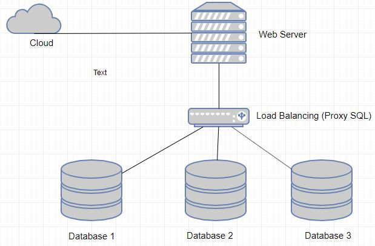
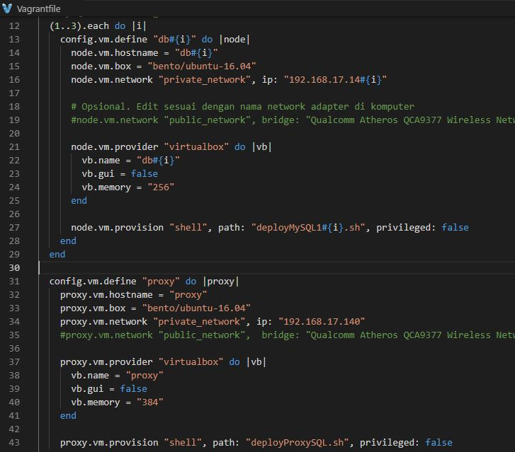

# ETS_BDT_05111740000140

## Desain Infranstruktur

<h3>Terdiri dari 4 server</h3>
 
-	Server untuk Web Server = Alamat IP 192.168.17.140; memiliki RAM 512MB; menggunakan sistem operasi ubuntu
-	Server untuk Load Balancer (Proxy SQL) = Alamat IP 192.168.17.141; memiliki RAM 512MB; menggunakan sistem operasi ubuntu
-	Server untuk Database pertama = Alamat IP 192.168.17.142; memiliki RAM 512MB; menggunakan sistem operasi ubuntu
-	Server untuk Database dua = Alamat IP 192.168.17.143; memiliki RAM 512MB; menggunakan sistem operasi ubuntu
-	Server untuk Database tiga = Alamat IP 192.168.17.144; memiliki RAM 512MB; menggunakan sistem operasi ubuntu

<h5>NB : Hub untuk menghubungkan 3 Database Server menuju Load Balancer karena di toolsnya server hanya terdapat 2 lubang LAN</h5>

## Langkah - Langkah Group Replication Dengan Vagrant

<h4>Langkah 1</h4>
- Mengatur vagrantfile seperti dibawah ini

<h4>Langkah 2</h4>
- Mengatur Shared replication group configuration dan Host specific replication configuration dari db 1

<h4>Langkah 3</h4>
- Mengatur Shared replication group configuration dan Host specific replication configuration dari db 2

<h4>Langkah 4</h4>
- Mengatur Shared replication group configuration dan Host specific replication configuration dari db 3

<h4>Langkah 5</h4>
- Mengaktifkan Cluster bootstrapping dari deployMySQL11

<h4>Langkah 6</h4>
- Mengaktifkan Cluster bootstrapping dari deployMySQL12

<h4>Langkah 7</h4>
- Mengaktifkan Cluster bootstrapping dari deployMySQL13

