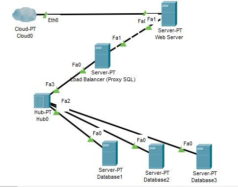

# ETS_BDT_05111740000140

##Desain Infranstruktur

 

 
-	Server untuk Web Server : alamat IP 192.168.17.140; memiliki RAM 512MB; menggunakan sistem operasi ubuntu
-	Server untuk Load Balancer (Proxy SQL) : alamat IP 192.168.17.141; memiliki RAM 512MB; menggunakan sistem operasi ubuntu
-	Server untuk Database pertama : alamat IP 192.168.17.142; memiliki RAM 512MB; menggunakan sistem operasi ubuntu
-	Server untuk Database dua : alamat IP 192.168.17.143; memiliki RAM 512MB; menggunakan sistem operasi ubuntu
-	Server untuk Database tiga : alamat IP 192.168.17.144; memiliki RAM 512MB; menggunakan sistem operasi ubuntu

